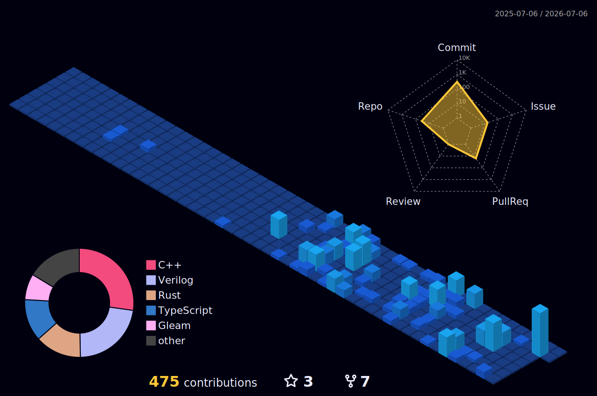

<div align="center">


<br>


</div>

<br>

<p align="center">
I work at the edges of computing — building game engines, verifying mathematics, composing algorithms into music.<br>
Each project is an attempt to find the precise language a problem deserves.
</p>

<br>

---

**`currently`**

```
NEXT               自研 C++ 游戏引擎，支撑中华历史朝代系列 IP（首作：两宋）
Raymdtxt           where thought meets the page without friction
nocturnes-in-code  fugues · IDM · melodic techno — synthesized from scratch
```

**`selected work`**

| | |
|:--|:--|
| [**Afterglow**](https://github.com/L0stInFades/Afterglow) | iOS Photos-style image viewer for Windows · Direct2D + spring physics · hero transitions |
| [**AnalysisTrinity**](https://github.com/L0stInFades/AnalysisTrinity) | Lean 4 · formal proofs of Nested Intervals · Bolzano-Weierstrass · Heine-Borel |
| [**Nevermind-Lang**](https://github.com/L0stInFades/Nevermind-Lang) | a language |
| [**Quench**](https://github.com/L0stInFades/Quench) | compression as meditation · extraction as gentle unfolding |
| [**Cocode-Precise**](https://github.com/L0stInFades/Cocode-Precise) | MCP server for exact code symbol retrieval |

---

<div align="center">


<br><br>


&nbsp;&nbsp;


<br><br>


<br><br>



<br>

<picture>
  <source media="(prefers-color-scheme: dark)" srcset="https://raw.githubusercontent.com/L0stInFades/L0stInFades/output/github-contribution-grid-snake-dark.svg" />
  <source media="(prefers-color-scheme: light)" srcset="https://raw.githubusercontent.com/L0stInFades/L0stInFades/output/github-contribution-grid-snake.svg" />
  
</picture>

</div>
